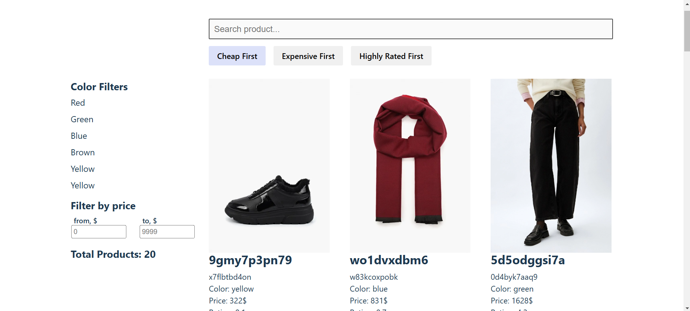

# Lamoda - Online Store



## Description
Lamoda is an online store built using React, TailwindCSS, and Vite. The main concept of the application is the differentiation of filter and catalog components, which ensures convenience and scalability. The primary goal of the development was to create a system that supports easy addition and removal of filters.

## Technologies
- React: A library for building user interfaces.
 - TailwindCSS: A utility-first CSS framework for rapid UI development.
 - Vite: A modern build tool for fast development of applications.

## Installation
 - Clone the repository:
    ```bash
    git clone https://github.com/Navi-Friend/lamoda
    ```

 - Navigate to the project directory:
    ```bash
    cd lamoda
    ```

 - Install the dependencies:
    ```bash
    npm install
    ```
 - Run the application:
    ```bash
    npm run dev
    ```

 - Open your browser

## Features
 - Flexible Filtering System: Easily add and remove filters to enhance user experience.

 - Scalable Architecture: Components are separated by functionality for easier maintenance and expansion.
 - Modern Interface: Utilizes TailwindCSS to create a responsive and visually appealing design.
